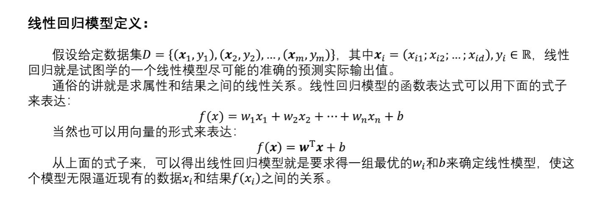
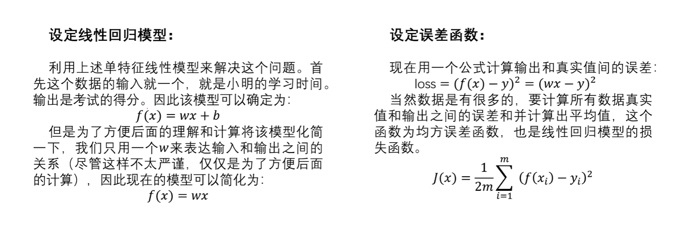
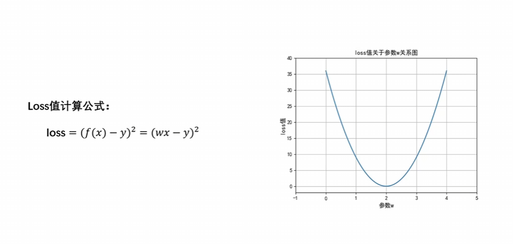
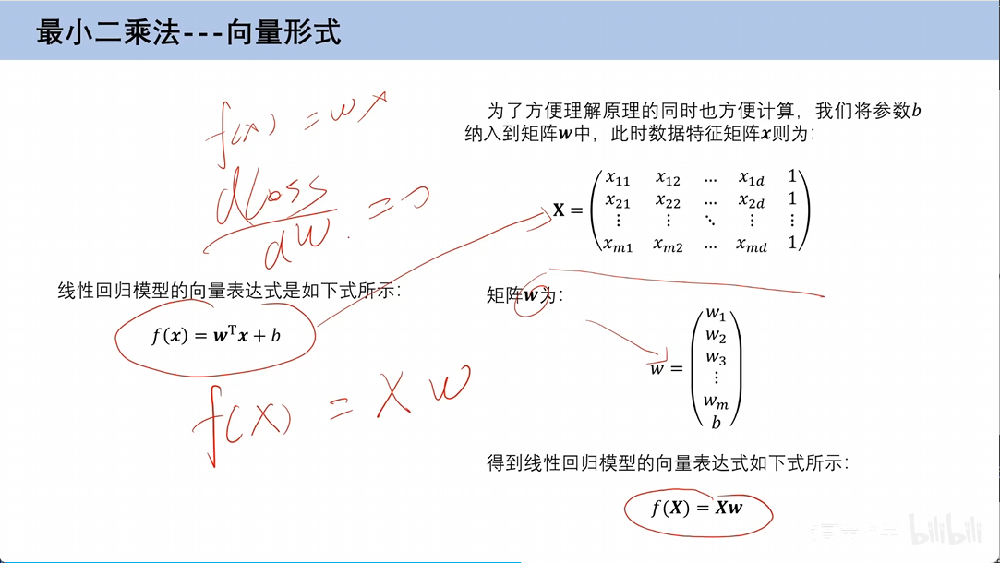
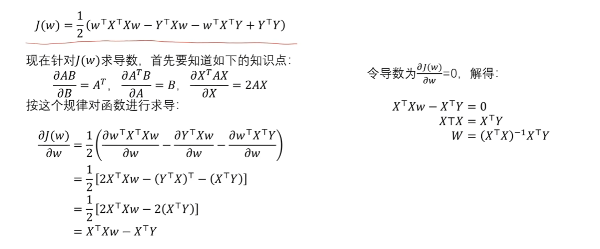

# 一、线性回归模型

## 1、线性回归定义



* x：特征
* y：标签
* w：权重

## 2、模型定义



误差函数：1/2m*误差函数

## 3、权值`w`的确定

### （1）穷举法


穷举法，就是每次通过穷举数值，通过计算`loss`值，来确定权值`w`。

### （2）最小二乘法



第一步：现在知道了`loss`的最小值，只需要对它的式子进行求导，一阶导数为0即可，就是所求点。




第二步：损失函数向量表示形式：


第三步：对损失函数进行数学求导



附加步骤：最小二乘法矩阵求导


缺点：并不是所有的矩阵，都存在可逆矩阵，所以最小二乘法存在缺陷。

### （3）梯度下降法

第一步：设置学习率

第二步：求解梯度

第三步：梯度参数更新


根据梯度下降法公式，如果最开始将学习率设置为0.1，那么可以的掉最终的w，但如果将学习率设置为0.5，就会出现距离正确值越来越远的情况。


# 二、代码
```python
"""
    # 1、实战内容
    线性回归，使用梯度下降法对小明的成绩进行求解。
    # 2、实战步骤
    第一步：
        数据，学习时间与成绩得分之间的关系。
    第二步：
        模型。
    第三步：
        损失函数。
    第四步：
        梯度求导。
    第五步：
        利用梯度更新参数。
    第六步：
        设置训练轮次。
    第七步：
        使用更新之后的参数，进行推理预测。
    # 3、个人理解
        （1）对于线性回归模型，咱们需要定义一个它的具体公式，研究x和y之间的关系，y一般等于w*x，这里可以将x理解为权值。
        （2）我们需要做的，就是找到这个权值w。
        ① 首先，如何对权值w进行更新？我们可以使用梯度进行更新，每次w进行一个梯度跳跃。
        ② 其次，因为我们并不知道“w进行一个梯度的条约是否正确，这个梯度是不是我们要找到梯度？”，
        因此我们可以将根据当前轮的w_now，计算出当前轮的预测数值y_pred=w_now*x，然后将“(预测值-真实值的平方)/len”作为当前轮次的损失值，如果损失值越来越小，那么就证明我们的梯度迭代方向是正确的。
        ③ 最后，我们只需要保证前两个步骤是正确的，那么按照梯度，不断迭代w就可以。
        （3）计算预测数值，并输出预测数值。
"""
# [第一步]，定义数据
x_data = [1, 2, 3]
y_data = [2, 4, 6]
# 初始化参数w
w = 4


# [第二步]，定义线性回归模型

def forward(x):
    return x * w


# [第三步]，定义损失函数
def cost(xs, ys):
    """
        将“预测值-真实值”的平方累加之后的结果/len作为第index轮的损失值
    """
    cost_value = 0
    for x, y in zip(x_data, y_data):
        # 计算x对应的预测值y_pred
        y_pred = forward(x)
        # 计算损失cost_value
        cost_value += (y_pred - y) ** 2
    # 返回损失平均数值
    return cost_value / max(len(x_data), len(y_data))


# [第四步]，定义计算梯度的公式
def gradient(xs, ys):
    """
        主要是利用第三步之中的损失函数，来不断更新梯度。
        梯度主要是用来更新w的。
    """
    # 初始化梯度
    gradient_value = 0
    for x, y in zip(x_data, y_data):
        gradient_value += 2 * x * (x * w - y)
    return gradient_value / max(len(x_data), len(y_data))


# [第五步]，利用梯度进行更新参数
for index in range(100):
    """
        利用损失值的不断减小，不断对梯度进行更新。
    """
    # 得到第index次的损失值
    cost_val = cost(x_data, y_data)
    # 计算梯度
    grad_val = gradient(x_data, y_data)
    # 参数更新
    w = w - 0.01 * grad_val
    print(f"训练轮次[{index}]===损失：{cost_val},梯度：{grad_val}，w：{w}")

print(f"训练4小时，得分为{forward(4)}")
# 训练4小时，得分为8.000444482757587
```