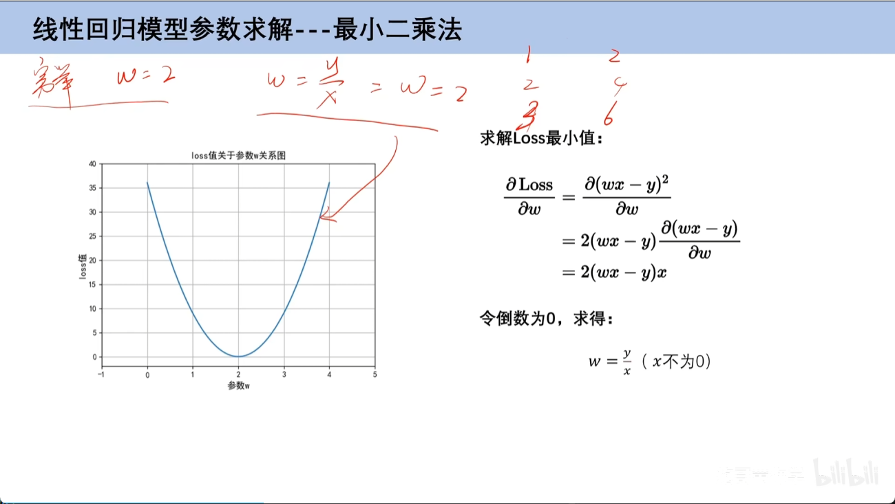
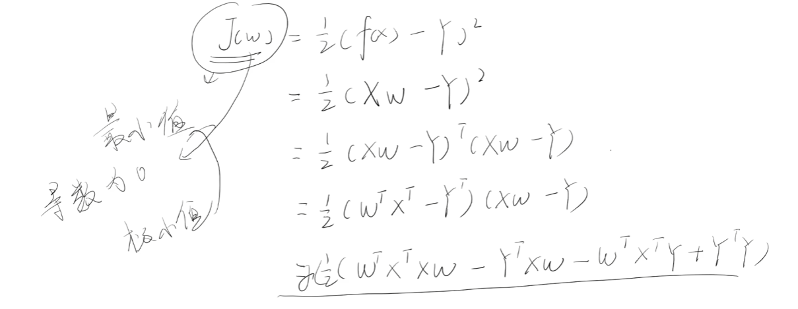
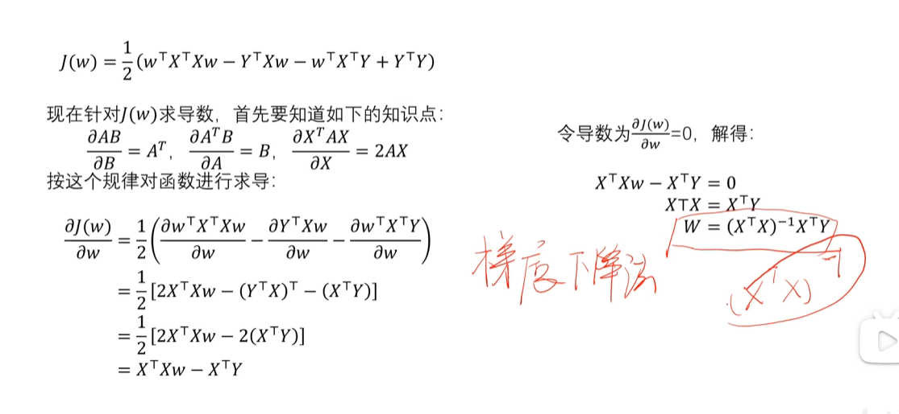
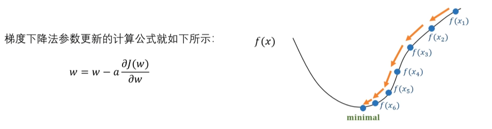
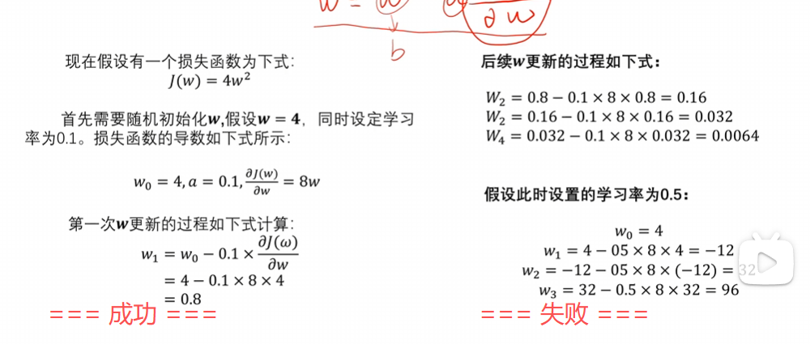
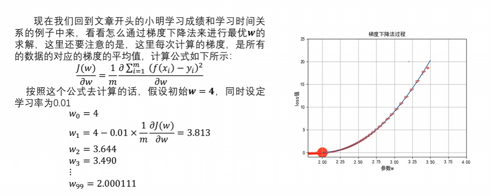

# 一、线性回归模型

## 1、线性回归定义

* x：特征
* y：标签
* w：权重

## 2、模型定义

误差函数：1/2m*误差函数

## 3、权值`w`的确定

### （1）穷举法

穷举法，就是每次通过穷举数值，通过计算`loss`值，来确定权值`w`。

### （2）最小二乘法

第一步：现在知道了`loss`的最小值，只需要对它的式子进行求导，一阶导数为0即可，就是所求点。

第二步：损失函数向量表示形式：

第三步：对损失函数进行数学求导

附加步骤：最小二乘法矩阵求导

缺点：并不是所有的矩阵，都存在可逆矩阵，所以最小二乘法存在缺陷。

### （3）梯度下降法

第一步：设置学习率

第二步：求解梯度

第三步：梯度参数更新

根据梯度下降法公式，如果最开始将学习率设置为0.1，那么可以的掉最终的w，但如果将学习率设置为0.5，就会出现距离正确值越来越远的情况。

